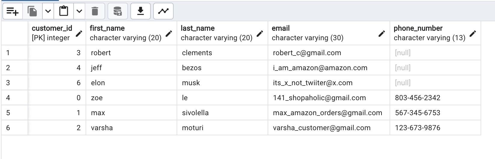
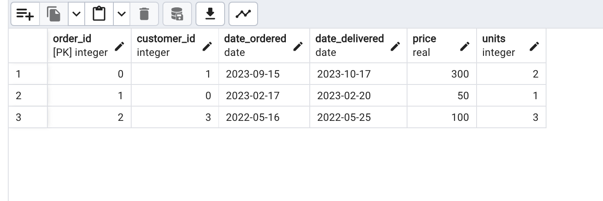

# Database Key

## Introduction
A database key is an attribute or set of attributes that uniquely identifies a row in a table. Keys are important for relational databases because they establish relationships between tables. 

## 3 Main types of key
- [PRIMARY KEY](#PRIMARY-KEY)
- [FOREIGN KEY](#FOREIGN-KEY)
- [UNIQUE KEY](#UNIQUE-KEY)

### PRIMARY KEY
A primary key is a unique column (or set of columns) assigned to relational database table(s) in order to uniquely identify each table entry. To easily parse the data in the table, a primary key is employed as a unique identifier. There shouldn't be a null primary key.

### FOREIGN KEY
A foreign key is a column (or set of columns) of data in one table that references certain data values, frequently the primary key values, in another table. In a relational database, foreign keys link together two or more tables.

### UNIQUE KEY
A unique Key is a specific value that is employed to prevent identical values from appearing in a column. To avoid duplicate values, a unique key in a table's primary function is to prevent them. However, the primary key also contains it when it comes to a unique value.

## SQL Query
Run the querries in file 

### Outputs
Customers table

Orders table

## Authors
- Varsha
- Max
- Zoe